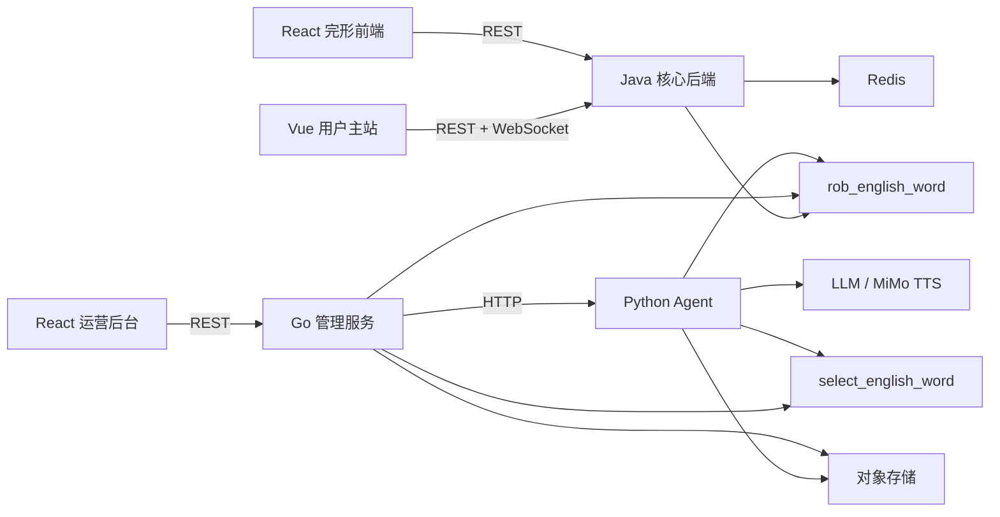

# 英语单词服务依赖和通信关系

## 关键边界

- Vue 用户主站不直接访问数据库或 Python Agent。
- 完形前端只通过 Java 业务 API提交和读取练习数据。
- React 管理端不直接访问业务库，跨库查询由 Go 服务完成。
- Go 保存配置与执行状态，并把计算型任务委托给 Python Agent。
- Java 的实时游戏状态依赖 Redis，但最终训练与结算记录进入 PostgreSQL。

## 变更检查

- 修改 API：同步检查调用前端、服务端路由和链路文档。
- 修改 WebSocket 消息：同步检查 Vue Store、Netty Handler、状态机和重连行为。
- 修改数据库字段：同步检查 Java Entity/Mapper、Go Model/Query 和 Python SQL。
- 修改模型或存储配置：同步检查 Go 配置发布、Agent 加载和历史任务兼容性。
